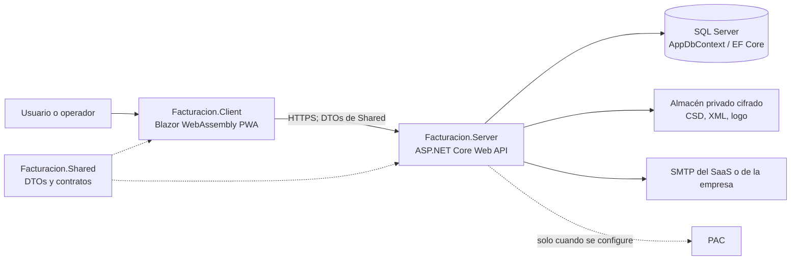
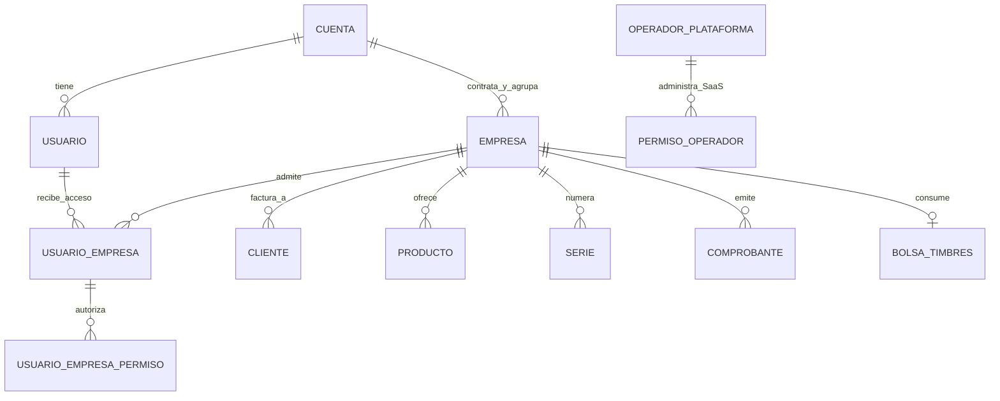

# Defensa técnica del sistema de facturación

**Corte de código: 7 de octubre de 2026.** Esta guía sirve para explicar el sistema a otro ingeniero; describe el repositorio, no certifica el estado de una base local o de Azure. La especificación del sistema anterior (`UI_Funcional.md`) es un inventario histórico de campos, no prueba de que todos sigan vigentes. Las reglas y el estado del producto se contrastaron con `AGENTS.md`, `AppDbContext`, configuraciones, endpoints y servicios actuales.

## 1. Respuesta de un minuto

Es una aplicación SaaS de facturación CFDI 4.0 para México, construida con .NET 10. El navegador ejecuta Blazor WebAssembly; la API ASP.NET Core valida permisos, reglas fiscales y operaciones; SQL Server conserva los datos mediante EF Core. Una **cuenta** es el contratante. Dentro de ella puede haber varias **empresas emisoras**, cada una con RFC, clientes, productos, series, comprobantes, saldo de timbres y configuración propios. Un **usuario** pertenece a la cuenta y accede solo a las empresas que figuran en `UsuariosEmpresas`; sus permisos se otorgan por empresa. El **operador** es personal del SaaS, no pertenece a una cuenta cliente y tiene otra identidad, audiencia de JWT y políticas. La integración PAC está preparada, pero no se debe afirmar que un CFDI real está timbrado hasta probarla con credenciales autorizadas. La pasarela de pagos no está implementada; las compras quedan pendientes y el operador puede acreditarlas manualmente.

## 2. Mapa de la solución y por qué se separó así

`Facturacion.Client` corre en el navegador y puede inspeccionarse: no es frontera de seguridad. `Facturacion.Server` sirve sus archivos estáticos y la API desde el mismo origen; allí están autenticación, tenencia, permisos, validaciones, impuestos, persistencia, generación XML/PDF e integración externa. `Facturacion.Shared` evita duplicar los tipos que viajan por HTTP y mantiene contratos entre plataforma y documentos; las firmas de `Contratos/` están congeladas y exigen un cambio deliberado. `tests/Facturacion.Pruebas` verifica comportamientos críticos y regresiones. No hay una base ni un esquema por empresa: es **una base compartida con separación lógica por `EmpresaId`**. No existe `TenantId` como eje de facturación ni autorización principal por roles.

Una petición común sigue: componente Razor → servicio HTTP del cliente → JWT Bearer → autenticación y política de la API → contexto de empresa obtenido del claim → servicio de negocio → EF Core/SQL Server → DTO de respuesta. La UI puede validar para comodidad, pero el servidor vuelve a validar. Los errores salen como Problem Details con identificador de traza. La PWA no cachea `/api/`, y `/api/version` permite advertir de cliente/servidor desalineados.

**Archivos para defenderlo:** `Facturacion.Server/Program.cs`, `Facturacion.Server/Infra/InfraestructuraModule.cs`, `Facturacion.Server/Data/AppDbContext.cs`, `Facturacion.Client/Program.cs`.

## 3. Cuenta, empresa, usuario, cliente y operador: cinco conceptos distintos

- **Cuenta (`Cuentas`)**: el contratante y la membresía. Una cuenta puede tener una o más empresas. No equivale a una factura ni a un receptor.
- **Empresa (`Empresas`)**: persona física o moral emisora, identificada por RFC y datos fiscales. `CuentaId` la une a su contratante. Dentro de la cuenta, el par `(CuentaId, Rfc)` es único. La empresa activa gobierna el aislamiento de trabajo.
- **Usuario (`AspNetUsers`)**: persona de la cuenta que inicia sesión. La tabla intermedia `UsuariosEmpresas` expresa a cuáles empresas puede entrar. `UsuariosEmpresasPermisos` expresa lo que puede hacer **en cada una**. Una persona puede timbrar en A y solo consultar en B sin crear dos cuentas de acceso.
- **Cliente (`Clientes`)**: receptor al que una empresa emisora factura. No es el contratante del SaaS. El mismo RFC receptor puede existir en distintas empresas porque cada una mantiene su propio expediente; dentro de una empresa el RFC no genérico es único. Los RFC genéricos se exceptúan del índice único.
- **Operador (`OperadoresPlataforma`)**: administrador del producto SaaS. No es `AspNetUsers`, no tiene `CuentaId` ni empresa activa. Su token tiene audiencia distinta y las rutas `/api/operador/*` exigen sus propias políticas. El principal no se desactiva desde el panel.

**Ejemplo defendible.** La cuenta «Grupo López» tiene «Llantera López» y «Constructora López». Ana pertenece a la cuenta; `UsuariosEmpresas` le da acceso a ambas. Al iniciar sesión con dos empresas disponibles debe elegir una. Al cambiarla, `/api/auth/cambiar-empresa` comprueba que sigue autorizada y emite un nuevo JWT con la empresa elegida. Los clientes, productos, folios y CFDI que ve Ana se consultan bajo esa empresa. Cambiar el selector no mueve ni copia datos; solo cambia el contexto de trabajo y sus permisos. Si Ana pierde acceso a la constructora, un refresh posterior descarta esa empresa activa. Una cuenta nueva comienza sin empresa ni permisos: el alta de la primera empresa se permite de forma especial y concede al creador los seis permisos; para crear otra debe administrar alguna empresa de la cuenta.

**Por qué esta elección.** Modela la relación comercial real sin duplicar identidad o pago por cada RFC emisor, pero mantiene separación fiscal. Una sola tabla con `CuentaId` en los comprobantes sería demasiado amplia: dos emisores de la misma cuenta verían datos mezclados. Una base por empresa multiplicaría migraciones, conexiones, respaldos y costo operativo; aquí se aceptó una base compartida con controles de aplicación e índices compuestos. Eso no equivale a aislamiento físico ni elimina la necesidad de auditar consultas especiales.

## 4. Cómo se impide que una empresa vea la de otra

1. El token del inquilino lleva `usuario`, `cuenta`, `empresa` activa y permisos de esa empresa. Excepto el cambio explícito de empresa, la API de facturación no debe aceptar un `empresaId` elegido por el navegador.
2. `ContextoEmpresaHttp` lee el claim, no un parámetro. `AppDbContext` captura esa empresa **por petición**. No usa `DbContextPool`, que podría reciclar contexto de otro inquilino.
3. `FiltroDeEmpresa` instala un query filter global en entidades que implementan `IEntidadDeEmpresa` o `IEntidadDeEmpresaOpcional`. Sin empresa activa, los datos de empresa no se devuelven. Esto protege lecturas normales de EF Core, no SQL crudo, `IgnoreQueryFilters` ni por sí solo escrituras.
4. `SelladoDeEmpresaInterceptor` pone/verifica `EmpresaId` al insertar entidades obligatorias y prohíbe cambiarlo en un registro existente. Las excepciones del modelo —cuenta, empresa, pertenencias, Identity, catálogos SAT, operador— requieren acotación explícita por cuenta, usuario o política.
5. Las relaciones e índices añaden integridad: RFC de cliente por empresa, RFC emisor por cuenta, folio por empresa/serie y UUID global. La autorización se aplica en endpoints, no solo ocultando botones.

**Límite honesto:** la arquitectura ayuda a aislar, pero el reporte de estado aún pide retomar una auditoría integral entre inquilinos. `IgnoreQueryFilters()` aparece en servicios legítimos —registro, selector, operador— y cada uso exige revisión. No hay que presentar el aislamiento como formalmente certificado ni asumir que SQL Server aplica row-level security: lo inspeccionado es filtro EF + sellado + políticas de API.

**Archivos:** `Data/FiltroDeEmpresa.cs`, `Infra/Tenencia/ContextoEmpresaHttp.cs`, `Infra/Tenencia/SelladoDeEmpresaInterceptor.cs`, `Modules/Plataforma/Auth/ServicioDeAutenticacion.cs`, `tests/Facturacion.Pruebas/AislamientoPorEmpresaPruebas.cs`.

## 5. Base de datos: mapa operativo, no solo dibujo

`AppDbContext` deriva de `IdentityUserContext<Usuario, Guid>` para usar Identity sin tablas de roles. Los `DbSet` agrupan identidad/plataforma, catálogos SAT compartidos, documentos y complementos. Cada configuración Fluent vive en `Data/Configurations`, se carga con `ApplyConfigurationsFromAssembly`, y los cambios de esquema se versionan en `Migrations`. En este corte hay **56 archivos de migración principales en el repositorio**; eso **no demuestra** que las 56 estén aplicadas a la BD local o Azure. Para comprobar una base concreta se compara `__EFMigrationsHistory` y `dotnet ef migrations list` con la conexión de ese entorno. No ejecutar `database update` a ciegas sin respaldo y verificar el destino.

| Grupo | Tablas/entidades importantes | Relación y propósito |
|---|---|---|
| Identidad | `Cuentas`, `Empresas`, `AspNetUsers`, `UsuariosEmpresas`, `UsuariosEmpresasPermiso`, `RefreshTokens` | Cuenta 1:N empresas/usuarios; usuario N:M empresas; permisos por vínculo. |
| Operación SaaS | `OperadoresPlataforma`, `PermisoOperador`, `Paquetes`, `CompraTimbres`, `Membresias`, `ConfiguracionDelSistema` | Panel separado; paquete global o dirigido a empresa; compra pendiente o acreditada. |
| Configuración emisora | `ConfiguracionesEmpresa`, `CorreosDeEmpresa`, `CertificadosCsd`, `Series` | Una configuración/SMTP por empresa; CSD protegido; serie y consecutivo por empresa. |
| Datos maestros | `Clientes`, `Productos`, `ProductosImpuestos`, `Vehiculos`, `FigurasTransporte` | Pertenecen a empresa; `Activo=false` conserva historial. |
| CFDI | `Comprobantes`, `Conceptos`, `ConceptosImpuestos`, `ComprobantesRelacionados`, `IntentosTimbrado`, `SolicitudesCancelacion`, `EnviosDeCorreo` | Documento y sus detalles, intentos, cancelación y bitácora de envíos. |
| Pagos | `Pagos`, `PagosDocumentos`, `PagosDocumentosImpuestos` | Complemento y documentos relacionados. |
| Timbres | `BolsasTimbres`, `ReservasTimbre`, `MovimientosTimbre`, `ReservasFolio` | Saldo, reservas y trazabilidad. |
| Variantes | `TrasladosCartaPorte`, ubicaciones y mercancías; `DatosNotaria`, inmuebles y partes; `DatosObra`; `DatosComercioExterior` | Datos especializados asociados a comprobante; no sustituyen su cabecera fiscal. |
| Referencia | `Sat*`, `CatalogoVersion` | Catálogos compartidos, no tienen `EmpresaId`; los grandes se buscan en servidor. |
| Control | `Bitacora`, `ClavesIdempotencia`, `AltasPendientes` | Auditoría, respuestas repetibles y registro verificado. |

El comprobante conserva **copias** del RFC, nombre y régimen del emisor/receptor y de los conceptos. `ClienteId`/`ProductoId` son trazabilidad, no la fuente de reimpresión. Así un cambio posterior en el catálogo no altera una factura histórica. `Folio` y `Uuid` pueden ser nulos en borrador; hay índices únicos filtrados que permiten muchos borradores y evitan duplicados una vez asignados. Los importes se calculan con `decimal(18,6)` y se presentan con dos decimales. Las fechas se almacenan en UTC y se muestran con el huso de la empresa. Las claves SAT compartidas tienen vigencia/versionado; los catálogos enormes se consultan por búsqueda, no se descargan completos en WebAssembly.

**No confundir eliminación física y desactivación.** Lo normal es `Activo=false` para preservar referencias. La excepción es un borrador nunca timbrado; no se borra un CFDI fiscal emitido. Las cascadas de los detalles sirven únicamente para ese borrador.

### Transacciones y concurrencia

El procedimiento `dbo.ReservarFolio` usa una actualización con bloqueo de actualización (`UPDLOCK`) y filtra por empresa; no se hace `MAX(Folio)+1`. Si el timbrado falla después de reservar, ese folio queda apartado, no se reutiliza. El saldo de timbres se manipula mediante procedimientos de reservar, confirmar, devolver y acreditar, de modo que comprobar saldo y restarlo sea atómico. El timbrado separa: **apartar en BD → llamar al PAC sin transacción abierta → resolver en BD**. Si la red deja resultado incierto, permanece en `timbrando` para conciliación; no se emite otra factura por suposición. Una `Idempotency-Key` protege las operaciones que cobran o timbran frente a reintentos.

**Archivos:** `Data/AppDbContext.cs`, `Data/Configurations/Documentos/ComprobanteConfiguracion.cs`, `Data/Configurations/Plataforma/ClienteConfiguracion.cs`, `Modules/Plataforma/Folios/ServicioDeFolios.cs`, `Modules/Plataforma/Timbres/ServicioDeTimbres.cs`, `Modules/Documentos/Timbrado/ServicioDeTimbrado.cs`.

## 6. Sesiones, permisos y secretos

El registro anónimo envía un código por correo y crea la cuenta/usuario **después** de verificarlo. Identity guarda el hash y gestiona bloqueos; la aplicación emite JWT propios. El access token del cliente está solo en memoria y dura 15 minutos según la configuración prevista; el refresh token va en cookie `HttpOnly`, `Secure`, `SameSite=Strict`, rota en cada uso y su reutilización revoca la familia. El arranque de la PWA intenta refresh antes de mostrar sesión. Un token de operador tiene audiencia `/operador` y credenciales HTTP separadas; no se puede usar como token de empresa. Seis permisos de empresa: `timbrar`, `cancelar`, `administrar_usuarios`, `comprar_timbres`, `ver_reportes`, `configurar_empresa`. El panel operador define 13 permisos propios (ver/actuar por sección), además de estar autenticado como operador. No hay roles jerárquicos en la BD.

El CSD y la contraseña de llave se protegen mediante Data Protection y llavero persistente protegido fuera del repositorio; XML, PDF y archivos no se publican directamente desde `wwwroot`. Desde octubre existe SMTP por empresa para **enviar sus facturas**: `CorreosDeEmpresa` guarda la contraseña cifrada con propósito por empresa y nunca la devuelve; se restringe el destino/puerto para evitar SSRF. Si está deshabilitado se usa el correo del SaaS; si está habilitado y falla, **no** hay cambio silencioso de remitente. Los correos de registro y seguridad siguen saliendo del SaaS. Gmail puede ser una opción SMTP de la empresa, pero su funcionamiento real depende de la configuración y políticas de esa cuenta, no del simple hecho de guardar credenciales.

**Archivos:** `Modules/Plataforma/Auth/ServicioDeTokens.cs`, `ServicioDeRefreshTokens.cs`, `Modules/Operador/Auth/`, `Shared/Comun/Permiso.cs`, `Shared/Operador/PermisosDePanel.cs`, `Modules/Plataforma/Empresas/ServicioDeConfiguracionDeCorreo.cs`, `Infra/Correo/DestinoSmtp.cs`, `Modules/Documentos/Salidas/ServicioDeEnvioDeComprobantes.cs`.

## 7. Flujos que un ingeniero probablemente te pedirá recorrer

### Alta de cuenta y varias empresas

1. La persona pide registro; recibe código y lo confirma; nacen `Cuenta` y `Usuario`, aún sin `Empresa`.
2. Inicia sesión. Como no tiene empresa, entra a crear la primera. Se validan RFC, nombre fiscal, régimen, CP y huso; se inserta `Empresa`, su vínculo en `UsuariosEmpresas` y sus seis permisos.
3. Tras obtener token con empresa activa, configura datos, CSD, series, clientes y productos. Si administra una empresa, puede crear otra en la misma cuenta.
4. Con varias, al iniciar sesión elige emisor. Cambiar de empresa verifica pertenencia/estado, actualiza el token y vuelve a cargar datos bajo el nuevo claim.

### Compra y acreditación de timbres

El cliente ve paquetes que devuelve el servidor y manda **solo el ID**. El servidor lee precio e IVA incluido y crea la compra pendiente, con una copia de los importes y de la identidad fiscal de la empresa. Pulsar «comprar» **no** aumenta saldo: no existe pasarela decidida. El operador autorizado revisa y acredita/rechaza; al acreditar se registra movimiento y saldo para **esa empresa**. El PDF de compra es comprobante de la operación de paquetes, **no CFDI timbrado**.

### Borrador → timbrado → entrega

La página crea/edita borrador; el servidor valida catálogo, datos fiscales y aritmética. Al timbrar se inmovilizan copias fiscales, se reservan folio y timbre, se genera/sella XML y se contacta al PAC fuera de transacción; después se confirma o concilia. El documento timbrado puede descargarse en XML/PDF y enviarse al receptor; el envío se registra. Cancelación, motivo y complemento de pagos tienen rutas y datos propios. Carta Porte, Comercio Exterior, Notaría y Obra ya tienen pantallas/servicios y almacenamiento, pero su corrección fiscal completa requiere casos reales y validación manual. **Sin PAC configurado, se pueden revisar borradores y salidas preliminares, no afirmar timbrado real.**

### Panel del operador

El operador inicia en `/operador/iniciar-sesion`; el panel `/operador` gestiona cuentas, empresas y licencias, usuarios, paquetes generales/personalizados, compras, membresías, operadores y configuración de plataforma, siempre según permisos de panel. Puede desactivar/reactivar una empresa sin borrar su historial. No usa el selector de empresa del cliente ni hereda sus seis permisos. En rutas de operador sí aparecen IDs de cuenta/empresa porque son operaciones administrativas, no endpoints de autoservicio del inquilino.

## 8. API: familias y control de acceso

| Familia | Ejemplos reales | Control |
|---|---|
| Sesión cliente | `POST /api/auth/registro`, `/registro/verificar`, `/iniciar-sesion`, `/refresh`, `/cambiar-empresa`; `GET /api/auth/sesion` | Anónimo solo donde corresponde; cambiar exige sesión y verifica vínculo. |
| Empresa/datos | `/api/empresa`, `/api/empresa/correo`, `/api/clientes`, `/api/productos`, `/api/series`, `/api/usuarios` | Empresa desde claim; escrituras según `configurar_empresa` o `administrar_usuarios`. |
| Catálogos | `/api/catalogos/precargables`, `/{catalogo}/buscar`, `/codigo-postal/{codigoPostal}/domicilio` | Sesión; grandes catálogos se buscan en servidor. |
| Timbres | `/api/timbres/saldo`, `/paquetes`, `/comprar`, `/compras`, `/movimientos` | Compra con `comprar_timbres`, precio del servidor e idempotencia. |
| Documentos | `/api/documentos/borradores`, `/{id}`, `/{id}/timbrar`, `/{id}/pdf`, `/{id}/xml`, `/{id}/enviar`, `/{id}/cancelar` | `timbrar` o `cancelar`, y query filter de empresa. |
| Especiales | `/api/pagos`, `/api/traslados-carta-porte`, `/api/comercio-exterior/comprobantes`, `/api/notaria`, `/api/obras/comprobantes` | Políticas de empresa y licencias/validaciones del módulo. |
| Operador | `/api/operador/auth`, `/cuentas`, `/usuarios`, `/compras`, `/paquetes`, `/membresias`, `/operadores`, `/configuracion` | Token de operador y permiso específico del panel. |

Es un mapa de familias, **no una especificación exhaustiva de todas las rutas ni sus cuerpos**. Para una integración, leer los `*Endpoints.cs` y DTOs de `Facturacion.Shared`. 

## 9. Estado real y demostración responsable

Hay código, migraciones y pruebas para los módulos citados. Eso no prueba que la base que abrirá el ingeniero esté actualizada, que sus catálogos SAT sean vigentes o que Azure tenga la misma versión. `docs/GUIA-ARQUITECTURA.md` y el diagrama HTML temporal contienen datos de un corte anterior; por ejemplo el HTML afirma 49 migraciones «aplicadas», mientras el repositorio tiene 56 migraciones principales, y ningún conteo de archivos puede certificar una aplicación a SQL Server. `REPORTE_ESTADO_SISTEMA.md` está fechado el 25 de septiembre y también requiere actualización antes de usarlo como estado actual.

Antes de presentar el sistema como listo: verificar compilación/pruebas en el commit a entregar, migraciones en la BD **concreta**, secretos y almacenamiento persistente del entorno, catálogo SAT cargado, flujos manuales por empresa y PAC real con el ingeniero. La pasarela de pagos está pendiente por decisión del proyecto. No usar el PDF preliminar como evidencia de CFDI certificado. La auditoría de aislamiento entre inquilinos sigue abierta según el reporte de estado.

## 10. Preguntas difíciles y respuestas cortas

1. **¿Qué es un inquilino aquí?** La cuenta es el contratante; la empresa es la unidad de aislamiento fiscal y operativo. Por eso ambos IDs tienen funciones diferentes.
2. **¿Por qué un cliente puede tener varias empresas?** Porque un contratante puede operar varios RFC emisores. Un mismo usuario se vincula a las empresas autorizadas sin mezclar sus datos.
3. **¿Dónde se decide cuál empresa está activa?** En la sesión y el claim del JWT, emitido tras verificar `UsuariosEmpresas`; no en un campo libre de cada petición.
4. **¿Qué evita que cambien un `empresaId` en el navegador?** La API de autoservicio toma el claim; filtro EF y sellado acotan lectura/escritura. No es solo una restricción visual.
5. **¿Por qué `Empresas` no tiene filtro global?** El selector debe listar todas las empresas accesibles; se acota por cuenta y membresía del usuario. Los datos de negocio sí se filtran por empresa activa.
6. **¿La misma persona puede tener distintos permisos en dos emisores?** Sí; la clave está en `UsuariosEmpresasPermisos` por usuario y empresa.
7. **¿Por qué no roles de administrador/capturista?** La autorización efectiva son permisos concretos por empresa; un rol fijo no expresaría bien diferencias entre emisores y acciones.
8. **¿El operador es un superusuario del cliente?** No: otra tabla, audiencia JWT, rutas y permisos. Puede administrar la plataforma según sus políticas, no «entrar» como empresa por herencia.
9. **¿Por qué una sola BD?** Reduce costo y complejidad de migraciones y operación; se compensa con filtros, sellado, autorización e índices. Es aislamiento lógico, no físico.
10. **¿Puede el filtro EF garantizar el aislamiento por sí solo?** No. Hay excepciones, `IgnoreQueryFilters`, SQL crudo y escrituras; por eso hay sellado, políticas y auditoría pendiente.
11. **¿Qué pasa si dos usuarios piden el mismo folio?** Lo reserva un procedimiento con `UPDLOCK` y condición de empresa; no se calcula con `MAX+1`.
12. **¿Por qué no se reutiliza un folio de intento fallido?** Para no asignar un mismo identificador a dos intentos/documentos y poder explicar los huecos.
13. **¿Qué pasa si el PAC responde tarde o cae la red?** No se supone fracaso ni se emite duplicado: queda `timbrando` y se concilia con el intento.
14. **¿Se deja una transacción abierta durante HTTP al PAC?** No; reserva y resolución son operaciones cortas separadas por la llamada externa.
15. **¿Por qué se copian datos del cliente y emisor al CFDI?** Una factura timbrada debe conservar el contenido emitido aunque cambien los catálogos maestros.
16. **¿Cómo se evita cobrar o timbrar dos veces al reintentar?** Claves de idempotencia, estado de operación y reservas/conciliación; hay que probar el caso en el entorno real.
17. **¿Quién determina el precio de timbres?** El servidor toma el paquete por ID y copia el precio en la compra; nunca confía en un importe mandado por el navegador.
18. **¿Pulsar comprar acredita saldo?** No. Crea solicitud pendiente. Un operador puede acreditarla manualmente hasta definir pasarela.
19. **¿El PDF de compra ya es factura fiscal?** No; es un comprobante de compra sin timbrado PAC.
20. **¿Cómo se guardan contraseñas/CSD?** Identity hashea contraseñas de usuarios; Data Protection cifra CSD y contraseñas SMTP. Las claves maestras deben persistir fuera del repo.
21. **¿La empresa puede usar su Gmail para facturas?** El sistema admite SMTP propio por empresa y lo aísla; la disponibilidad/autenticación de Gmail debe verificarse con la cuenta y su configuración. Registro del SaaS usa otro remitente.
22. **¿Qué ocurre si falla el SMTP de la empresa?** Se registra el intento y se informa el error; no se manda silenciosamente por el SaaS.
23. **¿Qué módulos especiales existen?** Carta Porte, Comercio Exterior, Notaría y Obra tienen código y datos; no afirmar certificación fiscal completa sin pruebas reales de cada variante.
24. **¿Puede demostrarse que Azure y local tienen la misma BD?** No por un `push`. Comparar versión desplegada, conexión, `__EFMigrationsHistory`, catálogos y configuración del entorno.
25. **¿Qué falta para entregar producción?** PAC real y pruebas autorizadas, conciliación/cancelación de extremo a extremo, validar módulos especiales, cerrar auditoría multitenencia, decidir pagos y verificar cada despliegue.

## 11. Guion oral de cinco minutos

1. Explica la jerarquía **cuenta → empresas emisoras → datos propios**, y **usuario ↔ empresas** con permisos por cada vínculo. Dibuja al operador aparte.
2. Recorre una petición: WASM, HTTPS, JWT, política, claim de empresa, filtro EF, servicio, SQL. Destaca que el navegador no es confiable.
3. Abre `AppDbContext`, `FiltroDeEmpresa` y `ServicioDeEmpresa.CrearAsync`: son las pruebas rápidas del modelo y de por qué la primera empresa es un caso especial.
4. Abre `Comprobante` y `ServicioDeFolios`: explica copia fiscal inmutable, folio concurrente y qué se hace si falla el PAC.
5. Cierra con límites verificables: código existente no equivale a despliegue/migración en Azure, CFDI real sin PAC, ni auditoría de aislamiento terminada.

**Frase final útil:** «Diseñamos la cuenta para la relación comercial, la empresa para el aislamiento fiscal, el usuario para la identidad y los permisos, y el operador para administrar el SaaS sin mezclarse con los inquilinos».
